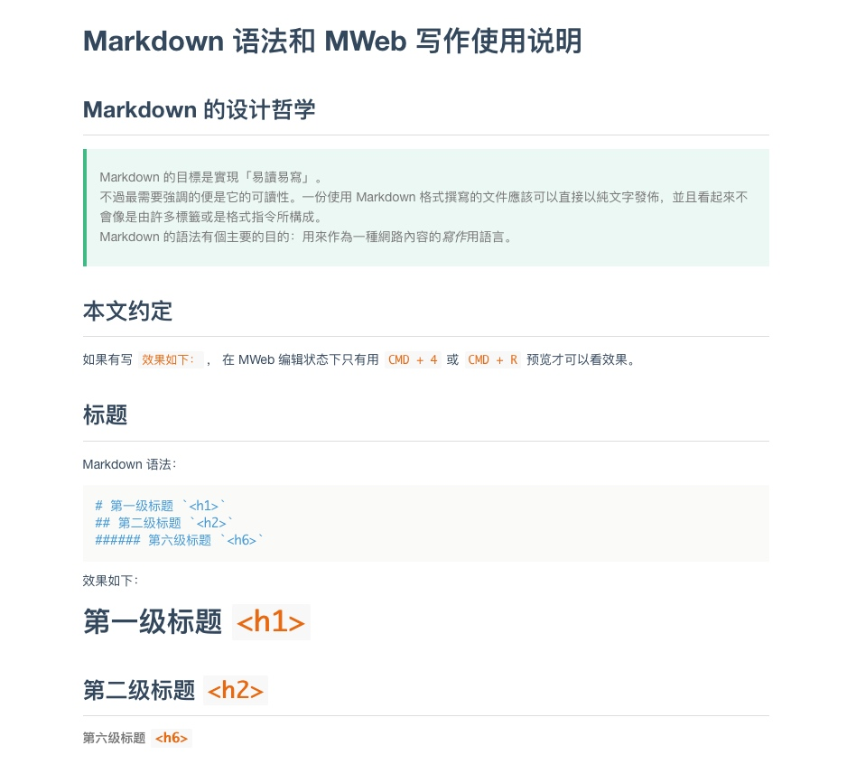

# MWeb 自定义预览主题
## 主题预览
### Typo
基于 [Typo.css](https://github.com/sofish/Typo.css) 修改：

### Vue
基于 [typora-vue-theme](https://github.com/blinkfox/typora-vue-theme) 修改：

## 使用主题
下载名为 `mweb-xxx.css` 的主题文件，将其保存到 `/Applications/MWeb.app/Contents/Resources/PreviewAsset/previewCSS`，然后在偏好设置里选择预览样式即可。

## 搜索主题
MWeb 的主题文件其实就是一系列的 CSS 文件。除了搜索 MWeb 专用的主题外，还可以搜索博客使用的主题，比如：
* typora 的主题：http://theme.typora.io/
* wordpress 的主题

下载 css 文件并命名为 `mweb-xxx.css` 即可在偏好设置里看到。有些主题可能无法生效，这是因为这些主题是为其他软件设计的，css 文件里可能使用了特殊的选择器。这需要你了解 css 语法，自行删除对应的选择器。

## 编辑主题文件
可以自己修改 `mweb-xxx.css` 文件。修改前要勾选“修改时请勾选、完成后请取消”的复选框。修改完成后随便换一个主题再换回来就可以看到效果了。

## 代码语法高亮
一般下载的主题里不包含代码语法高亮样式。MWeb 使用 PrismJS 来高亮代码块中的语法，可以自己查找 PrismJS 主题并将代码拷贝到某个主题文件里。也可以去 MWeb 自带的主题文件里复制相应的 css 代码（`PrismJS 1.14.0...` 注释块后面的全部内容）。

PrismJS 主题定制：https://prismjs.com/download.html
PrismJS 部分主题：https://github.com/PrismJS/prism-themes
一些 PrismJS 主题：https://ourcodeworld.com/articles/read/477/collection-of-the-best-open-source-prism-js-code-highlight-themes

## 自定义编辑器主题
编辑器主题是 `.style` 文件。同样可以在网上搜索主题文件，拷贝到 `~/Library/Containers/com.coderforart.MWeb3/Data/Documents/themes/EditorThemes/` 中，然后在偏好设置中更改。