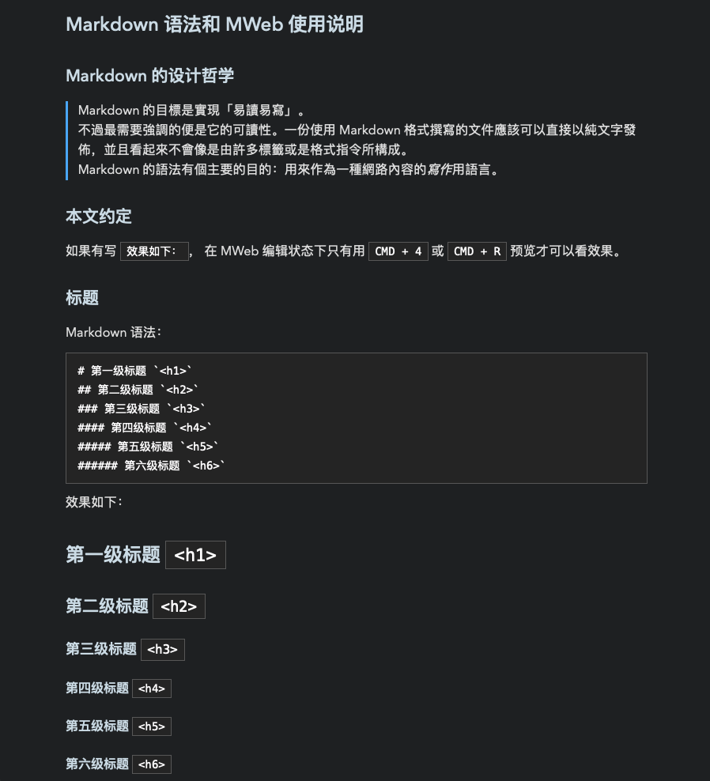

## MWeb-Themes

30+ 款 Markdown 预览主题，包括 [Typo.css](#typo)、[Vue](#vue)、[Bear](#bear-同款主题)、[Lark](#lark) 等风格，适用于 MWeb、Typora 等笔记软件，以及 Juejin、Jekyll、Hexo 等博客平台。
> TODO: 目前只支持 MWeb，其他平台需要修改 markdown-body 选择器

[在线预览所有主题](https://imageslr.github.io/mweb-themes)

## 目录
- [主题列表](#主题列表)
  - [浅色主题](#浅色主题)
  - [深色主题](#深色主题)
  - [部分主题预览](#部分主题预览)
    - [Typo](#typo)
    - [Vue](#vue)
    - [Indigo](#indigo)
    - [Lark](#lark)
    - [Bear 同款主题](#bear-同款主题)
  - [其他开源主题](#其他开源主题)
- [使用主题](#使用主题)
- [开发主题](#开发主题)
  - [目录结构](#目录结构)
  - [安装与运行](#安装与运行)
  - [新增一个 MWeb 主题](#新增一个-mweb-主题)
  - [新增一个 Prism 主题](#新增一个-prism-主题)
  - [打包为 CSS 文件](#打包为-css-文件)
- [Q & A](#q--a)

## 主题列表

### 浅色主题

```
ayu
bear-default
contrast
d-boring
default
duotone-heat
duotone-light
gandalf
indigo
jzman
lark
olive-dunk
red-graphite
smartblue
solarized-light
typo
v-green
vue
```

### 深色主题

```
ayu-mirage
charcoal
cobalt
dark-graphite
dieci
dracula
gotham
lighthouse
nord
panic
solarized-dark
toothpaste
```

### 部分主题预览
#### Typo
基于 [Typo.css](https://github.com/sofish/Typo.css) 修改：

<!--  -->

#### Vue
基于 [typora-vue-theme](https://github.com/blinkfox/typora-vue-theme) 修改：

<!--  -->

#### Indigo
基于 [MDTU](https://markdown.devtool.tech/app) 修改：

<!-- 
 -->

#### Lark
灵感来自 [飞书文档](https://docs.feishu.cn/docs)：


<!-- ### SmartBlue

基于 [smartblue](https://github.com/cumt-robin/juejin-markdown-theme-smart-blue) 修改：

 -->

<!-- ### Jzman
基于 [jzman](https://github.com/jzmanu/juejin-markdown-theme-jzman) 修改：

 -->

<!-- ### V-Green
基于 [v-green](https://github.com/DawnLck/juejin-markdown-theme-v-green) 修改：

 -->

#### Bear 同款主题
灵感来自 [Bear](https://bear.app/cn/faq/Themes/About%20free%20and%20Pro%20themes%20in%20Bear/) 的主题，**共 22 款**。

> 默认配置：字号 16px、页宽 46rem。如果希望和 Bear 完全一致（字号 14px、页宽 40em），请自行更改 [bear-default.scss](src/themes/variables/bear-default.scss) 中的相关变量并重新编译。

##### Red Graphite


<!-- ##### Ayu Mirage
 -->

##### Dark Graphite


<!--  -->

### 其他开源主题
* [JonoloLuo/MWeb-Theme-jonolo](https://github.com/JonoloLuo/MWeb-Theme-jonolo)：马克飞象风格

## 使用主题
1. 下载 [release](https://github.com/imageslr/mweb-themes/releases) 页面最新的主题压缩包 `mweb-themes.zip`
2. 打开 MWeb 偏好设置 - 预览样式 - 编辑 - 打开自定义样式所在的文件夹...（文件夹名为 `PreviewCSS`）
3. 将解压后的主题文件（.css 文件）拖到文件夹里
4. 点击 MWeb 偏好设置 - 预览样式 - 刷新，可以看到所有主题列表
5. 选择喜欢的主题

> 在掘金中使用主题，请参考 [juejin-markdown-themes](https://github.com/xitu/juejin-markdown-themes)。

## 开发主题

本项目提供了一个标准样式模板，可以通过设置变量（颜色、字号等）的方式快速开发一个新的**预览主题**。

可以从其他工具 / 平台的主题中获取灵感：
* 掘金的主题：https://github.com/xitu/juejin-markdown-themes
* typora 的主题：http://theme.typora.io/
* Hexo 的主题：https://hexo.io/themes/
* ...

欢迎贡献新的主题 🎉 ！


### 目录结构

```
example.md                    // 预览模板
src
├── views                     // HTML
└── themes                    // 主题目录
    ├── mweb-default.scss     // 默认主题
    ├── mweb-xxx.scss         // 另一个主题
    ├── prism-themes          // prism 代码高亮主题
    ├── core                  // 基础样式文件
    └── variables             // 各个主题的变量配置
```

### 安装与运行

环境：node v12 及以上。

```
# 克隆本仓库
git clone imageslr/mweb-themes 

# 进入此目录
cd mweb-themes

# 安装依赖
npm install

# 编译并预览主题
npm run watch <theme_file_path>
```

最后一个命令会编译指定的主题文件，`<theme_file_path>` 是主题文件的路径，默认为 `src/themes/mweb-default.scss`。

运行后，终端会输出一个地址，默认 `http://localhost:3000`，在浏览器中打开，即可预览主题。之后更改主题文件，浏览器会实时刷新。

### 新增一个 MWeb 主题

1. 在 `src/themes/variables` 目录下创建文件 `xxx.scss`，`xxx` 是主题名称
2. 在 `src/themes` 目录下创建文件 `mweb-xxx.scss`，内容如下：

    ```scss
    @import "prism-themes/default.scss";
    @import "variables/xxx.scss"; // 这里更换为第一步的文件名
    @import "core"
    ```

3. 在 `xxx.scss` 中按需更改[默认主题变量](src/themes/variables/default.scss)的值
4. 如果有特殊的样式需求，可以写在 `mweb-xxx.scss` 中
5. 在 `src/themes/config.js` 中增加主题配置项

### 新增一个 Prism 主题

1. 在 [PrismJS 官网](https://prismjs.com/) 选择一个主题，进入[下载页](https://prismjs.com/download.html)查看其 CSS 代码（拉到下载页底部就可以看到）
2. 在 `themes/prism-themes` 目录下创建文件 `xxx.scss`
3. 按需更改[颜色代码](src/themes/prism-themes/default.scss)
4. 更改 `mweb-xxx.scss` 中引用的 prism 主题文件

社区提供的 PrismJS 主题：
* [Github - PrismJS/prism-themes](https://github.com/PrismJS/prism-themes)
* [最佳 Prism.js 代码高亮主题集合](https://ourcodeworld.com/articles/read/477/collection-of-the-best-open-source-prism-js-code-highlight-themes)

### 打包为 CSS 文件
```
npm run compile # 打包所有文件
```

参数：
- `--file`：编译特定的主题文件，默认为空，即打包所有文件
- `--themeDir`：主题文件所在目录，默认为 `src/themes`
- `--distDir`：生成的 CSS 文件所在目录，默认为 `dist/themes`
- `--platform`：在哪里使用主题，默认为 `mweb`，支持 `juejin`、`typora`

注意：传递参数时，必须添加 `--` 分隔符。例如：

```
npm run compile -- --platform juejin # -- 是必须的
```

## Q & A

Q：如何自定义代码块的主题？  
A：MWeb 使用 PrismJS 来高亮代码块中的语法，可以自己查找 PrismJS 主题并配置颜色代码，见上文“开发主题”。

Q：代码块语法没有正确高亮？  
A：这是因为 MWeb 3.x 使用了基础版的 PrismJS，只支持部分语言，需要自行更新。
1. 前往 [PrismJS 官网](https://prismjs.com/download.html)，在 `Languages` 下方勾选 `Select/unselect all`，然后拉到底部点击 `Download JS`
2. 把下载的 `prism.js` 文件移动到 `/Applications/MWeb.app/Contents/Resources/PreviewAsset/prism` 文件夹
3. 重启 MWeb

Q：如何自定义 MWeb 编辑器主题？  
A：编辑器主题是 `.style` 文件，内容和 CSS 大同小异，请自行更改。
