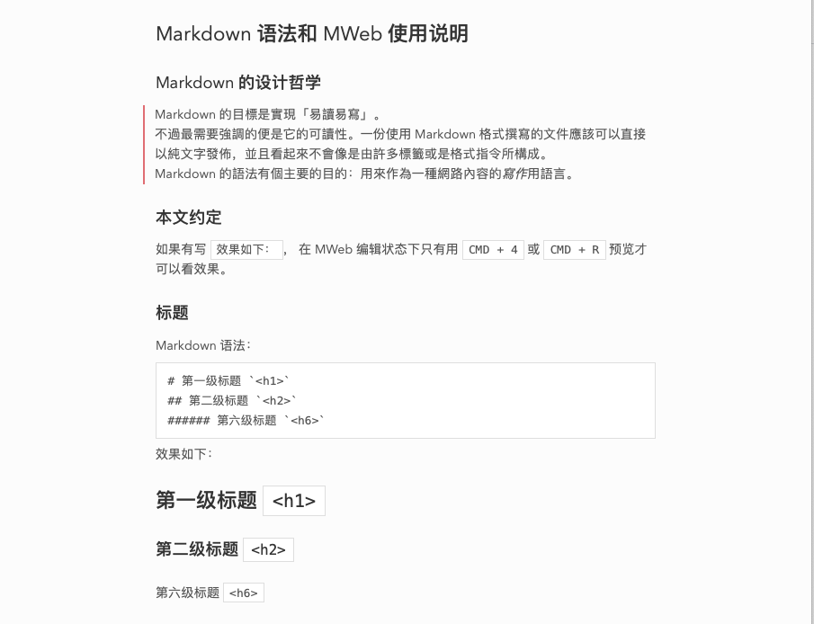
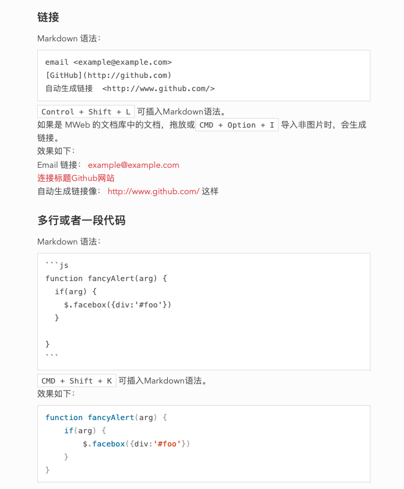

👏 欢迎大家推荐其他的 Markdown 预览主题，我很乐意适配到 MWeb！

- [主题列表](#主题列表)
  - [Typo](#typo)
  - [Vue](#vue)
  - [Indigo](#indigo)
  - [SmartBlue](#smartblue)
  - [Jzman](#jzman)
  - [V-Green](#v-green)
  - [Red Graphite](#red-graphite)
  - [其他](#其他)
- [使用主题](#使用主题)
- [开发主题](#开发主题)
- [Q & A](#q--a)

## 主题列表
### Typo
基于 [Typo.css](https://github.com/sofish/Typo.css) 修改：

### Vue
基于 [typora-vue-theme](https://github.com/blinkfox/typora-vue-theme) 修改：

### Indigo
基于 [MDTU](https://markdown.devtool.tech/app) 修改：

### SmartBlue

基于 [smartblue](https://github.com/cumt-robin/juejin-markdown-theme-smart-blue) 修改：

### Jzman
基于 [jzman](https://github.com/jzmanu/juejin-markdown-theme-jzman) 修改：

### V-Green
基于 [v-green](https://github.com/DawnLck/juejin-markdown-theme-v-green) 修改：

### Red Graphite
基于 [Bear](https://bear.app/cn/faq/Themes/About%20free%20and%20Pro%20themes%20in%20Bear/) 的主题修改：

### 其他
* [JonoloLuo/MWeb-Theme-jonolo](https://github.com/JonoloLuo/MWeb-Theme-jonolo)：马克飞象风格
## 使用主题
1. 下载名为 `mweb-xxx.css` 的主题文件
2. 打开 MWeb 偏好设置 - 预览样式 - 编辑 - 打开自定义样式所在的文件夹...
3. 将下载的主题文件（.css 文件）拖到文件夹里（一般是 `PreviewCSS`）
4. 点击 MWeb 偏好设置 - 预览样式 - 刷新，可以看到所有主题列表
5. 选择喜欢的主题

## 开发主题

本项目提供了一个标准样式模板，可以通过设置变量（颜色、字号等）的方式快速开发一个新的**预览主题**。

可以从其他工具 / 平台的主题中获取灵感：
* 掘金的主题：https://github.com/xitu/juejin-markdown-themes
* typora 的主题：http://theme.typora.io/
* Hexo 的主题：https://hexo.io/themes/
* ...

阅读[开发文档](src/)，了解如何将主题适配到 MWeb。

## Q & A

Q：如何自定义代码块的主题？  
A：MWeb 使用 PrismJS 来高亮代码块中的语法，可以自己查找 PrismJS 主题并将配置颜色代码。详细方法见[开发文档](src/README#prism)。

Q：如何自定义 MWeb 编辑器主题？  
A：编辑器主题是 `.style` 文件，内容和 CSS 大同小异，请自行更改。
